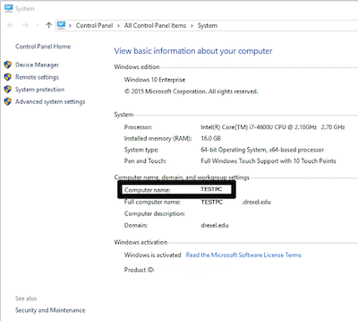
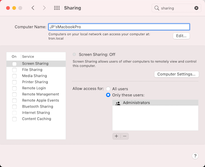

Choose your operating system below for how to find your computer name

### WINDOWS 10

1. Click on the Start button.
1. In the search box, type Computer.
1. Right click on This PC within the search results and select Properties.
1. Under Computer name, domain, and workgroup settings you will find the computer name listed.

### MAC OS X

1. Click on the Apple logo in the top left corner.
1. Click on System Preferences.
1. Click on Sharing.
1. The computer name will appear at the top of the window that opens in the Computer Name field.

